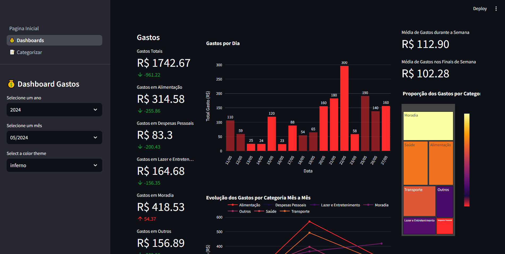

Este projeto visa a categorização de transações de cartão de crédito a partir de arquivos PDF, com a apresentação dos resultados em uma interface intuitiva. A motivação para a criação deste projeto surgiu da limitação do Banco do Brasil, que não oferece as transações em um formato estruturado e não classifica automaticamente os gastos por tipo. Esta solução exige um esforço inicial do usuário para classificar suas transações, mas proporciona uma visualização mais organizada e útil dos seus gastos ao longo do tempo.



# 🔧 Funcionalidades do projeto

- `Funcionalidade 1`: Categorização de transações manual de transações, essa categorização inicial será o "treinamento" da ferramenta de categorização.
- `Funcionalidade 2`: Categorização de transações autómática nas categorias definadas, o que não poder se classificado entra para categoria "Outros"
- `Funcionalidade 3`: Possibilidade de recategorização das transações classificadas como "Outros"
- `Funcionalidade 4`: Interface com dashboards para visualização dos dados.
- `Funcionalidade 5`: Interface para categorização manual de transações.

# 🛠️ Como rodar o projeto

Definir o arquivo .env com as credenciais: 
- OPENAI_API_KEY: Chave de acesso à API da OpenAI.
- EMAIL e EMAIL_PASS: Credenciais de autenticação da conta de email usada para enviar ou receber mensagens.
- REMITENTE: Email do remetente esperado para filtrar mensagens.
- SUBJECT_KEYWORD: Palavra-chave usada para identificar emails relevantes.
- PDF_PASS: Senha para desbloquear PDFs protegidos.

Construir as imagens: 
```
docker compose build
```

Criar o arquivo de exemplos da pasta data/, isso pode ser feito através da interface na aba de categorização:

Rodar a interface: 
```
docker compose up -d interface
```

Depois é só dar o run no script de categorização automática (só deve rodar uma vez ao mês, se são existirá duplicata no banco de dados):
```
docker compose run --rm process-data
```

## ✔️ Técnicas e tecnologias utilizadas

- ``Python``
- ``Langchain``
- ``LLM``
- ``Streamlite``

# Autor

| [<br><sub>Gustavo Barbosa</sub>](https://github.com/Gustavobrg)